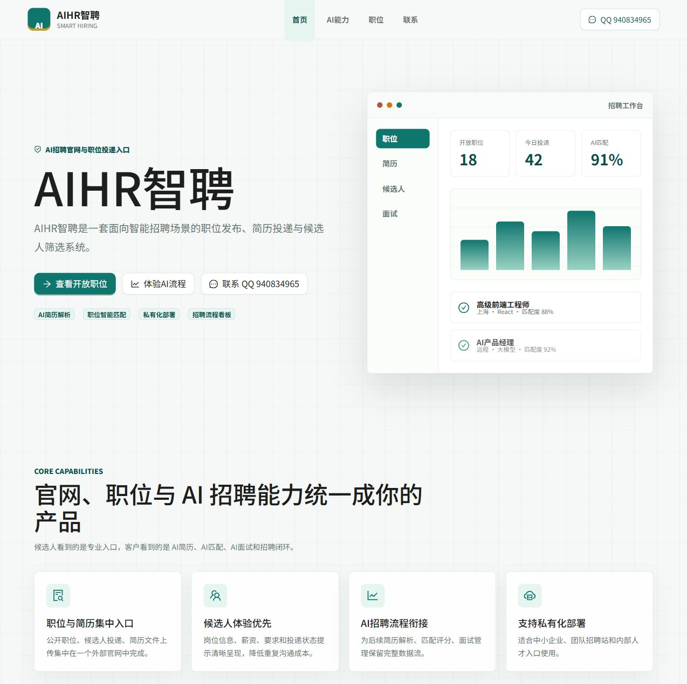
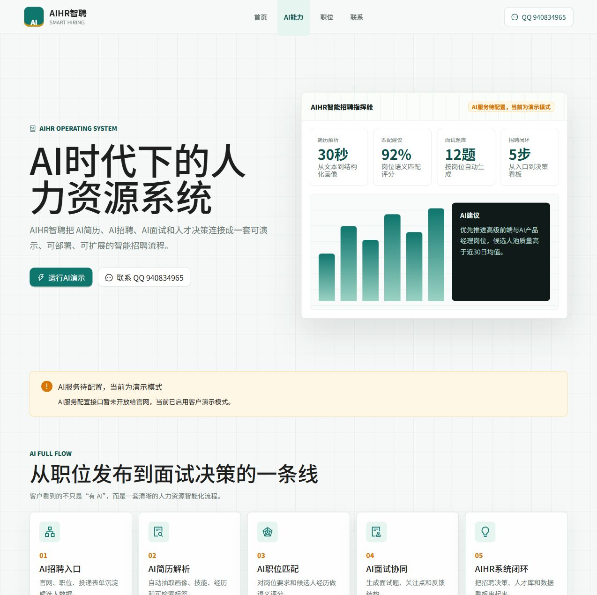
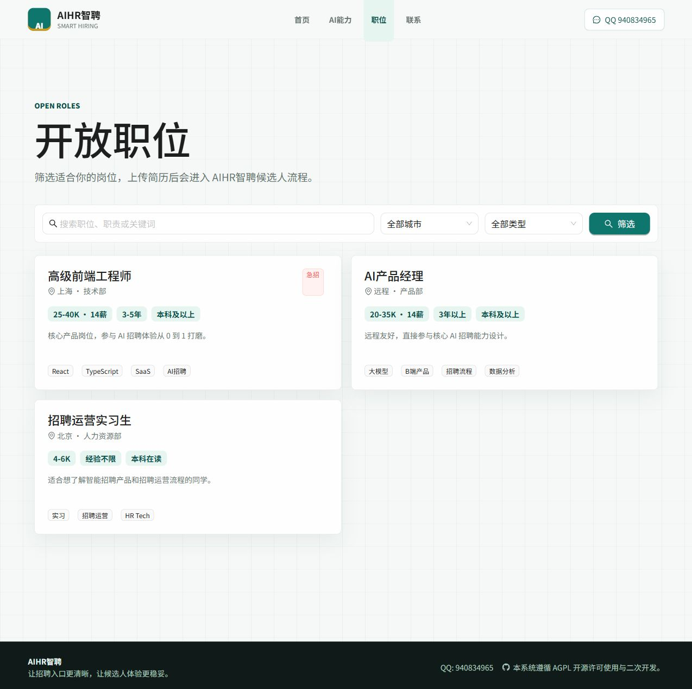

# AIHR智聘 - AI智能招聘官网与招聘系统

<p align="left">
  
  
  
  
  
  
</p>

<p align="center">
  
</p>

## 简介

AIHR智聘是一套面向企业招聘场景的 AI 智能招聘项目。系统围绕 AI简历、AI招聘、AI面试和 AIHR 人才管理闭环展开，帮助企业把职位发布、简历投递、智能筛选和面试协同放进同一个清晰的产品体验中。

当前公开官网支持：

- 品牌首页：展示 AIHR智聘的定位、核心能力和招聘流程。
- AI能力演示：展示 AI简历解析、职位匹配、JD 生成、面试题生成的完整流程。
- 职位列表：支持关键词、城市、职位类型筛选。
- 职位详情：展示薪资、经验、学历、职责、要求和标签。
- 在线投递：支持手机号重复投递校验、简历上传和留言提交。
- 联系入口：当前仅展示 QQ：940834965。

## 产品预览

| AI能力演示 | 职位招聘入口 |
| --- | --- |
|  |  |

AIHR智聘当前官网重点展示三条主线：

- 面向客户：用 AI 全流程页面讲清智能招聘系统能力。
- 面向候选人：用品牌官网、职位列表和投递表单承接简历。
- 面向企业部署：后端保留 AI 配置、简历解析、职位匹配、面试题生成等扩展能力。

## 技术栈

### 后端

- Java 17
- Spring Boot 3.2.5
- Sa-Token
- MyBatis-Plus
- PostgreSQL
- Redis

### 前端

- React 18
- TypeScript
- Ant Design 5
- Vite
- TailwindCSS

## 项目结构

```text
.
├── aihr-server/       # AIHR智聘后端服务
├── aihr-web/          # AIHR智聘官网与招聘投递前端
├── docs/              # 使用手册与项目文档
├── LICENSE            # AGPL 许可证
└── README.md
```

## 本地开发

### 后端

```bash
cd aihr-server
mvn spring-boot:run
```

后端默认端口为 `8080`，接口前缀为 `/api`。

### 前端

```bash
cd aihr-web
npm install
npm run dev
```

前端默认访问地址为 `http://localhost:3000`，Vite 会把 `/api` 代理到 `http://localhost:8080`。

## 公开接口

官网主要使用这些公开接口：

- `GET /api/public/company`
- `GET /api/public/jobs`
- `GET /api/public/jobs/{id}`
- `GET /api/public/cities`
- `GET /api/public/check-applied`
- `POST /api/public/upload-resume`
- `POST /api/public/apply`

## 联系方式

当前只开放 QQ 咨询：

- QQ：940834965

## 许可证

本项目遵循 AGPL 开源许可使用与二次开发。部署、分发和二次开发时请保留许可证文件，并遵守对应的源码开放义务。
